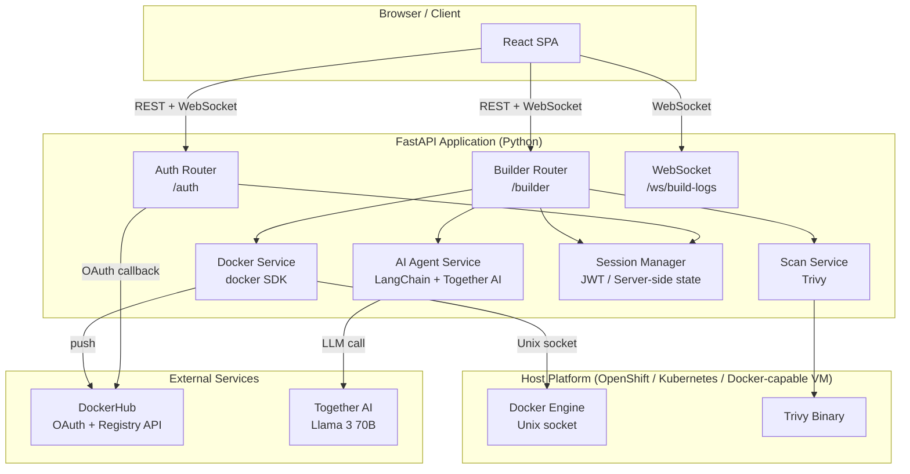
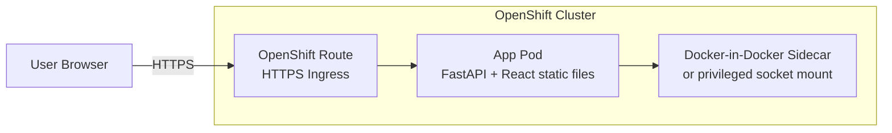
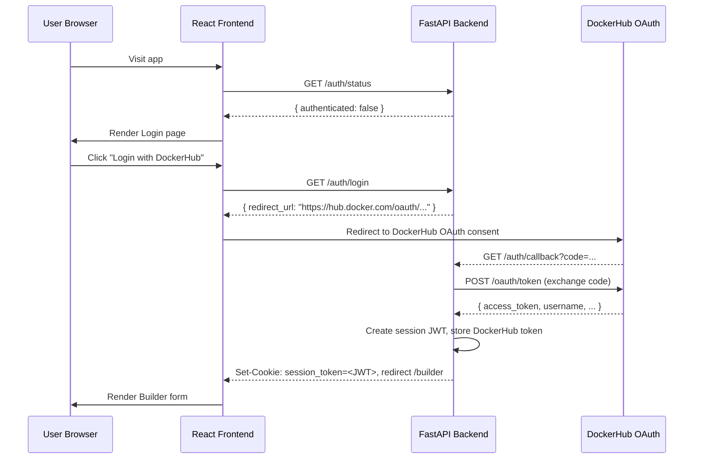
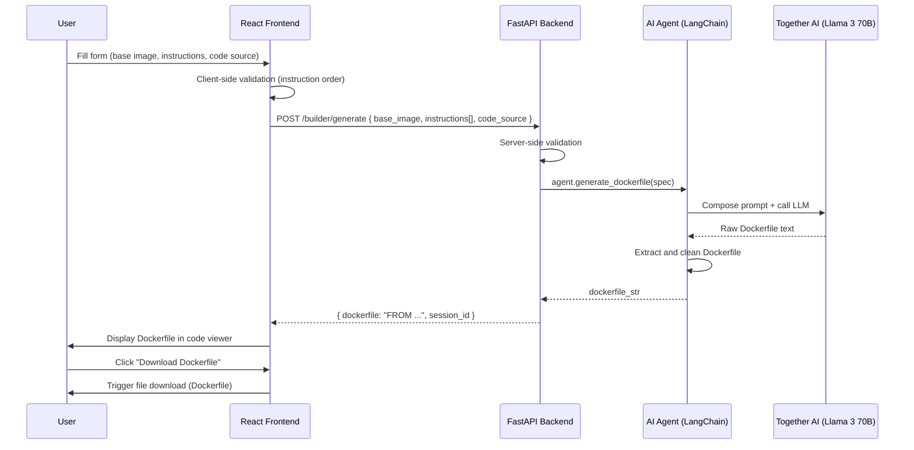
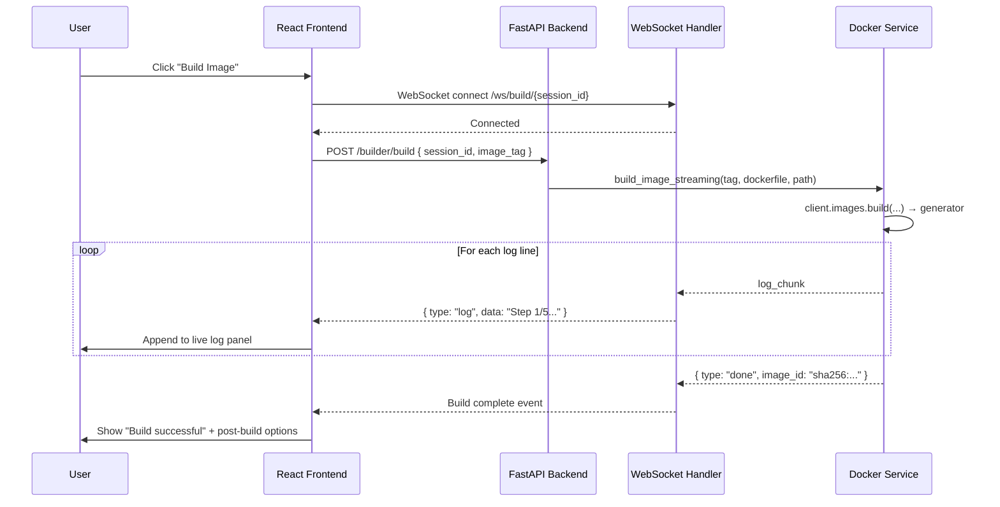
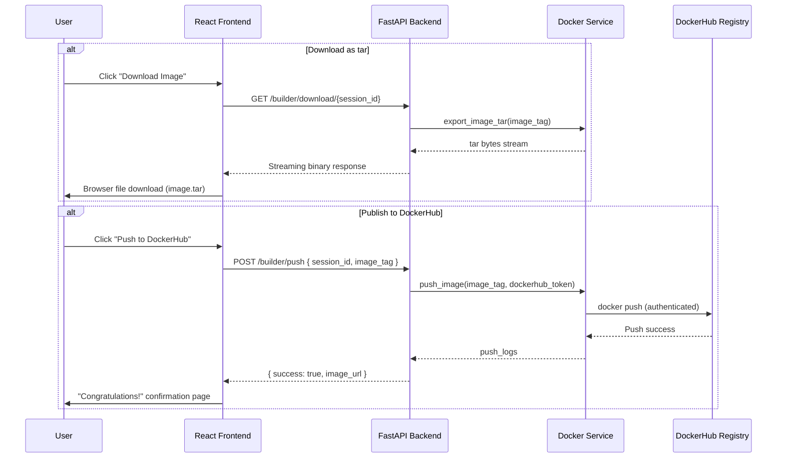

# Design Document: Dockerfile Webapp Builder

## Overview

The Dockerfile Webapp Builder evolves the existing Streamlit PoC into a full-featured, production-grade web application that guides users through the complete Docker image lifecycle: authenticate with DockerHub, compose a Dockerfile via a structured form UI, generate and review the Dockerfile (with AI assistance), build the image with live log streaming, scan for vulnerabilities, download or publish the image to DockerHub, and receive a completion confirmation.

The new webapp replaces the single-page Streamlit UI with a FastAPI backend and a React frontend, preserving and extending the existing Python tools (`dockerfile_gen.py`, `docker_build.py`, `docker_scan.py`) and the LangChain agent. The system is designed to run on OpenShift (or any platform that can co-host a Docker engine alongside a web process) and communicates with the host Docker engine via the Docker Python SDK socket mount.

---

## Architecture

### High-Level System Architecture



### Deployment Architecture (OpenShift)



> **Platform Note — Alternatives to OpenShift:**
> Any platform capable of running a Docker engine alongside a web process works. Recommended options include:
> - **Railway / Render / Fly.io** — cloud PaaS with Docker socket or privileged containers
> - **AWS EC2 / Azure VM / GCP Compute Engine** — full VM, run Docker engine natively
> - **DigitalOcean App Platform + Droplet sidecar** — separate Droplet hosts Docker daemon, app calls it over TCP
> - **Kubernetes with DinD (Docker-in-Docker)** — privileged sidecar container exposing Docker socket
> - **GitHub Codespaces / DevContainers** — development/demo environments
>
> The key constraint: the app process must be able to reach a Docker daemon, either via a Unix socket (`/var/run/docker.sock`) mount or a TCP endpoint (`DOCKER_HOST`).

---

## Sequence Diagrams

### Authentication Flow (DockerHub OAuth)



### Dockerfile Generation Flow



### Docker Build & Live Log Streaming Flow



### Image Export & Publish Flow



---

## Components and Interfaces

### Component 1: React Frontend (SPA)

**Purpose**: Provides the entire user-facing UI — login, Dockerfile builder form, code preview, live build log viewer, and completion screen.

**Interface** (REST calls to backend):
```
GET  /auth/status          → AuthStatus
GET  /auth/login           → { redirect_url: string }
GET  /auth/callback        → Sets session cookie, redirects
POST /builder/generate     → GenerateRequest → GenerateResponse
POST /builder/build        → BuildRequest → BuildResponse
GET  /builder/download/:id → StreamingResponse (binary)
POST /builder/push         → PushRequest → PushResponse
WS   /ws/build/:session_id → BuildLogEvent stream
```

**Responsibilities**:
- Render login page with DockerHub OAuth button
- Render multi-step builder form (base image + dynamic instruction list + code source)
- Client-side validation of Dockerfile instruction ordering
- Display generated Dockerfile in a syntax-highlighted code viewer
- Trigger file download for Dockerfile and image tar
- Open WebSocket for live build log streaming
- Render completion/congratulations page after successful push

---

### Component 2: FastAPI Backend

**Purpose**: Orchestrates all backend operations — auth sessions, AI generation, Docker builds, scans, and registry operations.

**Interface** (Python module structure):
```python
# routers/auth.py
router = APIRouter(prefix="/auth")

@router.get("/status") -> AuthStatus
@router.get("/login")  -> RedirectResponse
@router.get("/callback") -> RedirectResponse  # OAuth callback

# routers/builder.py
router = APIRouter(prefix="/builder")

@router.post("/generate") -> GenerateResponse
@router.post("/build")    -> BuildResponse
@router.get("/download/{session_id}") -> StreamingResponse
@router.post("/push")     -> PushResponse

# routers/ws.py
@app.websocket("/ws/build/{session_id}")
```

**Responsibilities**:
- Validate JWT session on every protected route
- Coordinate AI agent, Docker service, and scan service
- Manage per-session state (Dockerfile content, built image tag, DockerHub token)
- Stream Docker build logs via WebSocket
- Handle graceful errors and return structured error responses

---

### Component 3: AI Agent Service

**Purpose**: Wraps the existing LangChain agent and Together AI integration to generate Dockerfiles from structured form input.

**Interface**:
```python
class AIAgentService:
    def generate_dockerfile(self, spec: DockerfileSpec) -> str:
        """
        Build a prompt from the structured spec and invoke the LLM.
        Returns cleaned Dockerfile content.
        """

    def _build_prompt(self, spec: DockerfileSpec) -> str: ...
    def _extract_dockerfile(self, llm_output: str) -> str: ...
```

**Responsibilities**:
- Convert `DockerfileSpec` (base image + ordered instructions + code source) into a prompt
- Call the Together AI LLM via LangChain
- Extract and sanitize the Dockerfile from LLM output (strip markdown fences, explanations)
- Return a valid Dockerfile string

---

### Component 4: Docker Service

**Purpose**: Wraps the Docker Python SDK for all container operations — build, export, push.

**Interface**:
```python
class DockerService:
    def build_image_streaming(
        self, tag: str, dockerfile_content: str, build_context_path: str
    ) -> Generator[BuildLogEvent, None, None]:
        """Yields BuildLogEvent dicts as Docker build progresses."""

    def export_image_tar(self, image_tag: str) -> Generator[bytes, None, None]:
        """Yields binary chunks of the image tar archive."""

    def push_image(
        self, image_tag: str, username: str, token: str
    ) -> str:
        """Pushes image to DockerHub. Returns push log string."""

    def tag_image(self, current_tag: str, new_tag: str) -> None: ...
    def remove_image(self, image_tag: str, force: bool = False) -> None: ...
```

**Responsibilities**:
- Write Dockerfile and context files to a temp directory
- Invoke `docker.APIClient.build()` in streaming mode
- Parse Docker SDK build log dictionaries into `BuildLogEvent`
- Authenticate with DockerHub using the user's OAuth token before push
- Export image as streaming tar for download
- Clean up temp directories after use

---

### Component 5: Scan Service

**Purpose**: Wraps the existing Trivy integration to scan built images for vulnerabilities.

**Interface**:
```python
class ScanService:
    def scan_image(self, image_tag: str) -> ScanResult:
        """
        Runs Trivy scan on the given image.
        Returns structured ScanResult with severity summary.
        """
```

**Responsibilities**:
- Execute `trivy image <tag>` via subprocess
- Parse stdout into a `ScanResult` with vulnerability counts by severity
- Return `ScanResult` to the backend router for inclusion in the build response

---

### Component 6: Session Manager

**Purpose**: Issues and validates JWT session tokens; stores per-session state in server memory (or Redis for multi-replica deployments).

**Interface**:
```python
class SessionManager:
    def create_session(self, user: DockerHubUser) -> str:
        """Creates JWT and stores session state. Returns token."""

    def get_session(self, token: str) -> Session:
        """Validates JWT and returns session. Raises if invalid/expired."""

    def update_session(self, token: str, **kwargs) -> None: ...
    def delete_session(self, token: str) -> None: ...
```

**Responsibilities**:
- Sign and verify JWTs using a configurable secret
- Store mutable session state (dockerfile content, image tag, DockerHub token) server-side
- Support session TTL and cleanup

---

## Data Models

### AuthStatus
```python
class AuthStatus(BaseModel):
    authenticated: bool
    username: Optional[str] = None
    avatar_url: Optional[str] = None
```

### DockerfileInstruction
```python
class DockerfileInstruction(BaseModel):
    instruction: Literal[
        "ADD", "ARG", "CMD", "COPY", "ENTRYPOINT", "ENV",
        "EXPOSE", "FROM", "HEALTHCHECK", "LABEL", "MAINTAINER",
        "ONBUILD", "RUN", "SHELL", "STOPSIGNAL", "USER", "VOLUME", "WORKDIR"
    ]
    value: str  # The argument(s) to the instruction

    @validator("value")
    def value_must_not_be_empty(cls, v):
        if not v.strip():
            raise ValueError("Instruction value cannot be empty")
        return v.strip()
```

### DockerfileSpec
```python
class DockerfileSpec(BaseModel):
    base_image: str               # Required, e.g. "python:3.11-slim"
    instructions: List[DockerfileInstruction] = []
    code_source: Optional[CodeSource] = None

    @validator("base_image")
    def base_image_must_not_be_empty(cls, v):
        if not v.strip():
            raise ValueError("Base image is required")
        return v.strip()
```

### CodeSource
```python
class CodeSource(BaseModel):
    source_type: Literal["github_url", "local_path"]
    value: str  # URL or path string

    @validator("value")
    def validate_value(cls, v, values):
        if values.get("source_type") == "github_url":
            if not v.startswith("https://github.com/"):
                raise ValueError("Must be a valid GitHub HTTPS URL")
        return v
```

### GenerateRequest / GenerateResponse
```python
class GenerateRequest(BaseModel):
    spec: DockerfileSpec

class GenerateResponse(BaseModel):
    session_id: str
    dockerfile: str
    warnings: List[str] = []   # e.g. instruction order warnings
```

### BuildRequest / BuildResponse
```python
class BuildRequest(BaseModel):
    session_id: str
    image_tag: str  # e.g. "username/myapp:1.0"

class BuildResponse(BaseModel):
    success: bool
    image_id: Optional[str] = None
    scan_result: Optional[ScanResult] = None
    error: Optional[str] = None
```

### ScanResult
```python
class ScanResult(BaseModel):
    critical: int = 0
    high: int = 0
    medium: int = 0
    low: int = 0
    unknown: int = 0
    raw_output: str
```

### BuildLogEvent
```python
class BuildLogEvent(TypedDict):
    type: Literal["log", "error", "done"]
    data: str            # Log line text or error message
    image_id: Optional[str]  # Present only when type == "done"
```

### Session
```python
class Session(BaseModel):
    session_id: str
    user: DockerHubUser
    dockerfile_content: Optional[str] = None
    built_image_tag: Optional[str] = None
    dockerhub_token: str
    created_at: datetime
    expires_at: datetime
```

### DockerHubUser
```python
class DockerHubUser(BaseModel):
    username: str
    access_token: str
    refresh_token: Optional[str] = None
    avatar_url: Optional[str] = None
```

### PushRequest / PushResponse
```python
class PushRequest(BaseModel):
    session_id: str
    image_tag: str

class PushResponse(BaseModel):
    success: bool
    image_url: Optional[str] = None  # e.g. "https://hub.docker.com/r/user/image"
    error: Optional[str] = None
```

---

## Algorithmic Pseudocode

### Main Dockerfile Generation Algorithm

```python
ALGORITHM generate_dockerfile(request: GenerateRequest, session: Session) -> GenerateResponse

INPUT:  request — DockerfileSpec with base_image, instructions[], code_source
OUTPUT: GenerateResponse with session_id, dockerfile, warnings[]

BEGIN
    ASSERT request.spec.base_image is non-empty

    # Step 1: Server-side validation
    warnings ← validate_instruction_order(request.spec.instructions)

    # Step 2: Build prompt
    prompt ← build_llm_prompt(
        base_image   = request.spec.base_image,
        instructions = request.spec.instructions,
        code_source  = request.spec.code_source
    )

    # Step 3: Call LLM via agent
    raw_output ← llm_agent.invoke(prompt)

    # Step 4: Extract clean Dockerfile
    dockerfile ← extract_dockerfile(raw_output)
    ASSERT dockerfile starts with "FROM"

    # Step 5: Persist to session
    session.dockerfile_content ← dockerfile
    session_manager.update_session(session.session_id, dockerfile_content=dockerfile)

    RETURN GenerateResponse(
        session_id = session.session_id,
        dockerfile = dockerfile,
        warnings   = warnings
    )
END
```

**Preconditions:**
- `session` is valid and authenticated
- `request.spec.base_image` is non-empty

**Postconditions:**
- `session.dockerfile_content` is updated
- Returned `dockerfile` begins with a `FROM` instruction
- `warnings` contains any instruction-order advisory messages (non-blocking)

---

### Instruction Order Validation Algorithm

```python
ALGORITHM validate_instruction_order(instructions: List[DockerfileInstruction]) -> List[str]

INPUT:  instructions — ordered list of Dockerfile instructions (excluding the leading FROM)
OUTPUT: warnings — list of human-readable advisory strings

# Dockerfile instruction ordering rules:
#   - FROM must be first (handled by base_image field — not in this list)
#   - ARG before FROM is allowed; ARG after FROM is scoped to build stage
#   - WORKDIR should precede COPY/ADD/RUN that rely on it
#   - CMD/ENTRYPOINT typically appear last
#   - Multiple CMDs: only the last takes effect

VALID_ORDER_HINTS = {
    "WORKDIR": must_precede(["COPY", "ADD", "RUN"]),
    "CMD":     should_be_near_end(),
    "ENTRYPOINT": should_be_near_end(),
}

BEGIN
    warnings ← []

    FOR i, instr IN enumerate(instructions) DO
        IF instr.instruction == "CMD" AND
           any(j > i AND instructions[j].instruction == "CMD" for j in range(len(instructions))) THEN
            warnings.append("Multiple CMD instructions detected; only the last one takes effect")
        END IF

        IF instr.instruction IN ["COPY", "ADD"] AND
           not any(instructions[j].instruction == "WORKDIR" for j < i) THEN
            warnings.append(f"{instr.instruction} used before WORKDIR is set; files may land in /")
        END IF

        IF instr.instruction == "RUN" AND
           i > 0 AND instructions[i-1].instruction == "CMD" THEN
            warnings.append("RUN after CMD is unusual; CMD typically appears at the end")
        END IF
    END FOR

    RETURN warnings
END
```

**Preconditions:**
- `instructions` is a list (may be empty)

**Postconditions:**
- Returns a list of strings (may be empty if no issues found)
- Does not mutate input list

**Loop Invariants:**
- All previously checked instructions have been analyzed
- `warnings` contains only strings

---

### Docker Build Streaming Algorithm

```python
ALGORITHM build_image_streaming(
    tag: str,
    dockerfile_content: str,
    context_path: str
) -> Generator[BuildLogEvent]

INPUT:  tag               — Docker image tag, e.g. "user/app:1.0"
        dockerfile_content — Dockerfile string
        context_path       — path to build context directory
OUTPUT: generator of BuildLogEvent dicts

BEGIN
    # Step 1: Write Dockerfile to temp dir
    tmp_dir ← create_temp_directory()
    write_file(tmp_dir / "Dockerfile", dockerfile_content)

    # Step 2: Copy context files if any
    IF context_path exists AND is_directory(context_path) THEN
        copy_tree(context_path, tmp_dir)
    END IF

    # Step 3: Invoke Docker build via low-level API client (streaming)
    api_client ← docker.APIClient()
    build_generator ← api_client.build(
        path     = tmp_dir,
        tag      = tag,
        decode   = True,   # decode JSON log objects
        rm       = True    # remove intermediate containers
    )

    # Step 4: Stream log events
    FOR log_obj IN build_generator DO
        IF "stream" IN log_obj THEN
            YIELD BuildLogEvent(type="log", data=log_obj["stream"].strip())
        ELSE IF "error" IN log_obj THEN
            YIELD BuildLogEvent(type="error", data=log_obj["error"])
            RAISE DockerBuildError(log_obj["error"])
        ELSE IF "aux" IN log_obj THEN
            # Final event contains image ID
            image_id ← log_obj["aux"].get("ID", "")
            YIELD BuildLogEvent(type="done", data="Build complete", image_id=image_id)
        END IF
    END FOR

FINALLY
    cleanup_temp_directory(tmp_dir)
END
```

**Preconditions:**
- Docker daemon is reachable
- `tag` is a valid image tag string
- `dockerfile_content` is non-empty and starts with `FROM`

**Postconditions:**
- Generator yields at least one `BuildLogEvent` before completing
- If build succeeds, last event has `type == "done"` with `image_id`
- If build fails, last event has `type == "error"`
- Temp directory is cleaned up regardless of outcome

**Loop Invariants:**
- Each iteration yields exactly one `BuildLogEvent`
- `tmp_dir` remains valid for the duration of the loop

---

### Image Export Algorithm

```python
ALGORITHM export_image_tar(image_tag: str) -> Generator[bytes]

INPUT:  image_tag — tag of a locally built image
OUTPUT: generator of byte chunks (tar archive)

BEGIN
    client ← docker.from_env()
    image  ← client.images.get(image_tag)   # raises ImageNotFound if absent

    ASSERT image is not None

    FOR chunk IN image.save(named=True) DO
        YIELD chunk
    END FOR
END
```

**Preconditions:**
- Image with `image_tag` exists locally
- Docker daemon is reachable

**Postconditions:**
- All yielded chunks concatenated form a valid Docker image tar archive
- Caller is responsible for streaming response to the client

---

### DockerHub Push Algorithm

```python
ALGORITHM push_image(image_tag: str, username: str, access_token: str) -> str

INPUT:  image_tag    — fully qualified tag, e.g. "myuser/myapp:1.0"
        username     — DockerHub username from OAuth session
        access_token — DockerHub OAuth access token

OUTPUT: push_logs string or raises PushError

BEGIN
    client ← docker.from_env()

    # Step 1: Authenticate
    client.login(username=username, password=access_token, registry="https://index.docker.io/v1/")

    # Step 2: Ensure tag includes username prefix
    IF NOT image_tag.startswith(f"{username}/") THEN
        new_tag ← f"{username}/{image_tag}"
        client.images.get(image_tag).tag(new_tag)
        image_tag ← new_tag
    END IF

    # Step 3: Push
    push_output ← client.images.push(repository=image_tag, stream=True, decode=True)
    logs ← []

    FOR event IN push_output DO
        IF "error" IN event THEN
            RAISE PushError(event["error"])
        END IF
        IF "status" IN event THEN
            logs.append(event["status"])
        END IF
    END FOR

    RETURN "\n".join(logs)
END
```

**Preconditions:**
- `image_tag` references a locally available image
- `access_token` is a valid DockerHub OAuth token with `repo:write` scope
- Docker daemon is reachable

**Postconditions:**
- Image is available on DockerHub at `https://hub.docker.com/r/{username}/{repo}`
- Returns non-empty log string on success
- Raises `PushError` with descriptive message on failure

---

## Key Functions with Formal Specifications

### `build_llm_prompt()`

```python
def build_llm_prompt(
    base_image: str,
    instructions: List[DockerfileInstruction],
    code_source: Optional[CodeSource]
) -> str:
```

**Preconditions:**
- `base_image` is non-empty string
- `instructions` is a list (may be empty)

**Postconditions:**
- Returns a non-empty string prompt
- Prompt contains the base image reference
- Prompt contains each instruction in order
- If `code_source` is provided, prompt includes code location context

---

### `extract_dockerfile()`

```python
def extract_dockerfile(llm_output: str) -> str:
```

**Preconditions:**
- `llm_output` is a non-empty string (LLM response)

**Postconditions:**
- Returns a string starting with `FROM` (after stripping markdown fences and preamble text)
- If no `FROM` is found, raises `DockerfileExtractionError`
- No trailing whitespace in result

---

### `validate_instruction_order()`

```python
def validate_instruction_order(instructions: List[DockerfileInstruction]) -> List[str]:
```

**Preconditions:**
- `instructions` is a list of `DockerfileInstruction` objects (may be empty)

**Postconditions:**
- Returns a list of human-readable warning strings (may be empty)
- Does not raise exceptions
- Does not mutate the input list

---

### `create_session()` / `get_session()`

```python
def create_session(user: DockerHubUser) -> str:          # returns JWT token
def get_session(token: str) -> Session:                  # raises if invalid
```

**Preconditions (create):**
- `user.username` is non-empty
- `user.access_token` is non-empty

**Postconditions (create):**
- Returns a signed JWT string
- Session is stored server-side and retrievable within TTL

**Preconditions (get):**
- `token` is a non-empty string

**Postconditions (get):**
- Returns valid `Session` if token is valid and not expired
- Raises `SessionExpiredError` if TTL has elapsed
- Raises `InvalidTokenError` if signature check fails

---

## Example Usage

```python
# ---- Example 1: Generate a Dockerfile ----
from models import DockerfileSpec, DockerfileInstruction, GenerateRequest

spec = DockerfileSpec(
    base_image="python:3.11-slim",
    instructions=[
        DockerfileInstruction(instruction="WORKDIR", value="/app"),
        DockerfileInstruction(instruction="COPY",    value=". ."),
        DockerfileInstruction(instruction="RUN",     value="pip install -r requirements.txt"),
        DockerfileInstruction(instruction="EXPOSE",  value="8000"),
        DockerfileInstruction(instruction="CMD",     value='["uvicorn", "main:app", "--host", "0.0.0.0"]'),
    ],
    code_source=None
)

request = GenerateRequest(spec=spec)
response = await generate_endpoint(request, session=current_session)
print(response.dockerfile)
# FROM python:3.11-slim
# WORKDIR /app
# ...


# ---- Example 2: Stream build logs via WebSocket ----
# Client-side (JavaScript pseudocode)
# const ws = new WebSocket(`wss://app.example.com/ws/build/${sessionId}`)
# ws.onmessage = (event) => {
#     const log = JSON.parse(event.data)
#     if (log.type === "log") appendToLogPanel(log.data)
#     if (log.type === "done") showBuildSuccess(log.image_id)
#     if (log.type === "error") showBuildError(log.data)
# }
#
# fetch(`/builder/build`, {
#     method: "POST",
#     body: JSON.stringify({ session_id: sessionId, image_tag: "myuser/myapp:1.0" })
# })


# ---- Example 3: Export image as tar ----
import httpx

async with httpx.AsyncClient() as client:
    async with client.stream("GET", f"/builder/download/{session_id}") as r:
        with open("image.tar", "wb") as f:
            async for chunk in r.aiter_bytes():
                f.write(chunk)


# ---- Example 4: Push to DockerHub ----
push_resp = await client.post("/builder/push", json={
    "session_id": session_id,
    "image_tag": "myuser/myapp:1.0"
})
if push_resp.json()["success"]:
    print("Published!", push_resp.json()["image_url"])
```

---

## Correctness Properties

*A property is a characteristic or behavior that should hold true across all valid executions of a system — essentially, a formal statement about what the system should do. Properties serve as the bridge between human-readable specifications and machine-verifiable correctness guarantees.*

### Property 1: Dockerfile always begins with FROM

*For any* valid `DockerfileSpec` with a non-empty `base_image`, the Dockerfile returned by `generate_dockerfile` must start with a `FROM` instruction.

**Validates: Requirements 5.1, 5.3**

```python
# hypothesis property test
@given(spec=valid_dockerfile_specs())
def test_dockerfile_starts_with_from(spec):
    response = generate_dockerfile(spec)
    assert response.dockerfile.strip().startswith("FROM")
```

### Property 2: Instruction validation is non-mutating

*For any* valid list of `DockerfileInstruction` objects (including empty), calling `validate_instruction_order` must leave the input list unchanged.

**Validates: Requirements 4.4**

```python
@given(instructions=lists(dockerfile_instructions()))
def test_validation_does_not_mutate(instructions):
    original = instructions.copy()
    validate_instruction_order(instructions)
    assert instructions == original
```

### Property 3: Session round-trip identity

*For any* `DockerHubUser`, creating a session and immediately retrieving it must return the same username.

**Validates: Requirements 2.1, 2.2**

```python
@given(user=dockerhub_users())
def test_session_round_trip(user):
    token = session_manager.create_session(user)
    session = session_manager.get_session(token)
    assert session.user.username == user.username
```

### Property 4: Export produces a valid tar archive

*For any* locally existing image tag, the byte stream returned by `export_image_tar` must form a valid tar archive when concatenated.

**Validates: Requirements 8.1, 8.2**

```python
@given(image_tag=sampled_from(local_image_tags()))
def test_export_is_valid_tar(image_tag):
    import tarfile, io
    chunks = list(export_image_tar(image_tag))
    buf = io.BytesIO(b"".join(chunks))
    assert tarfile.is_tarfile(buf)
```

### Property 5: Instruction validation always returns a list

*For any* valid list of `DockerfileInstruction` objects (including empty lists), `validate_instruction_order` always returns a list, never `None`, and never raises an exception.

**Validates: Requirements 4.3**

```python
@given(instructions=lists(dockerfile_instructions()))
def test_validation_always_returns_list(instructions):
    result = validate_instruction_order(instructions)
    assert result is not None
    assert isinstance(result, list)
```

### Property 6: Push always prefixes the authenticated username

*For any* image tag and any authenticated username, the resolved tag used by `push_image` must start with the authenticated username followed by `/`.

**Validates: Requirements 9.2**

```python
@given(image_tag=text(), username=text(min_size=1))
def test_push_prefixes_username(image_tag, username, mock_token):
    result_tag = normalize_pushed_tag(image_tag, username)
    assert result_tag.startswith(f"{username}/")
```

### Property 7: Prompt contains base image

*For any* non-empty `base_image` string and any list of instructions, `build_llm_prompt` must return a string that contains the `base_image` value.

**Validates: Requirements 11.1**

```python
@given(base_image=text(min_size=1), instructions=lists(dockerfile_instructions()))
def test_prompt_contains_base_image(base_image, instructions):
    prompt = build_llm_prompt(base_image, instructions, code_source=None)
    assert base_image in prompt
```

### Property 8: Prompt contains all instructions in order

*For any* list of `DockerfileInstruction` objects, `build_llm_prompt` must return a string in which each instruction keyword appears in the same relative order as in the input list.

**Validates: Requirements 11.2**

```python
@given(instructions=lists(dockerfile_instructions(), min_size=1))
def test_prompt_preserves_instruction_order(instructions):
    prompt = build_llm_prompt("python:3.11-slim", instructions, code_source=None)
    positions = [prompt.index(i.instruction) for i in instructions if i.instruction in prompt]
    assert positions == sorted(positions)
```

### Property 9: extract_dockerfile strips markdown fences

*For any* LLM output string that wraps a Dockerfile in a markdown code fence (` ```dockerfile ` or ` ``` `), `extract_dockerfile` must return only the content inside the fence with no fence markers remaining.

**Validates: Requirements 11.4**

```python
@given(dockerfile_body=valid_dockerfile_bodies())
def test_extract_strips_fences(dockerfile_body):
    fenced = f"```dockerfile\n{dockerfile_body}\n```"
    result = extract_dockerfile(fenced)
    assert not result.startswith("```")
    assert not result.endswith("```")
    assert result.strip().startswith("FROM")
```

### Property 10: COPY/ADD before WORKDIR produces a warning

*For any* instruction list where a `COPY` or `ADD` instruction appears before any `WORKDIR` instruction, `validate_instruction_order` must return a list containing at least one warning string.

**Validates: Requirements 4.1**

```python
@given(instructions=instruction_lists_with_copy_before_workdir())
def test_copy_before_workdir_warns(instructions):
    warnings = validate_instruction_order(instructions)
    assert len(warnings) >= 1
```

### Property 11: Multiple CMD instructions produce a warning

*For any* instruction list containing more than one `CMD` instruction, `validate_instruction_order` must return a list containing at least one warning string.

**Validates: Requirements 4.2**

```python
@given(instructions=instruction_lists_with_multiple_cmd())
def test_multiple_cmd_warns(instructions):
    warnings = validate_instruction_order(instructions)
    assert len(warnings) >= 1
```

---

## Error Handling

### Error Scenario 1: DockerHub OAuth Failure

**Condition**: OAuth callback receives an error code, or token exchange fails.
**Response**: Backend returns `400 Bad Request` with `{ error: "oauth_failed", message: "..." }`. Frontend redirects user back to login page with an error banner.
**Recovery**: User may retry login or use a different account.

---

### Error Scenario 2: LLM Generation Failure

**Condition**: Together AI returns an error, times out, or the extracted output contains no `FROM` instruction.
**Response**: Backend returns `502 Bad Gateway` with `{ error: "generation_failed" }`. Frontend shows error message with option to retry.
**Recovery**: User may retry generation. Backend retries once internally before propagating error.

---

### Error Scenario 3: Docker Build Failure

**Condition**: `docker build` process exits with non-zero status (e.g., `RUN` command fails).
**Response**: WebSocket receives `BuildLogEvent(type="error", data="<error line>")`. Frontend displays error in the log panel and disables "Download / Push" buttons.
**Recovery**: User reviews the Dockerfile (pre-filled with their inputs), modifies instructions, and regenerates.

---

### Error Scenario 4: Docker Daemon Unreachable

**Condition**: `docker.from_env()` raises `DockerException` (daemon not running or socket not mounted).
**Response**: Backend returns `503 Service Unavailable` with `{ error: "docker_unavailable" }`. Frontend displays a platform error page.
**Recovery**: Platform operator ensures Docker socket is mounted in the app pod.

---

### Error Scenario 5: Image Push Authentication / Authorization Failure

**Condition**: DockerHub rejects the push due to expired token or insufficient permissions.
**Response**: Backend catches `APIError` and returns `403 Forbidden` with `{ error: "push_denied" }`. Frontend prompts user to re-authenticate.
**Recovery**: User logs out and logs back in to refresh the DockerHub OAuth token.

---

### Error Scenario 6: Session Expired

**Condition**: JWT TTL has elapsed (default: 2 hours).
**Response**: Any protected route returns `401 Unauthorized` with `{ error: "session_expired" }`. Frontend clears session state and redirects to login.
**Recovery**: User logs in again. In-progress Dockerfile form data is preserved in `localStorage` for auto-restore.

---

## Testing Strategy

### Unit Testing Approach

Each service class is unit-tested in isolation with mocked dependencies.

Key unit test cases:
- `validate_instruction_order`: all permutations of instruction lists, empty list, single instruction, all valid
- `extract_dockerfile`: markdown-fenced output, no-fence output, missing `FROM`, multi-line LLM preamble
- `build_llm_prompt`: verifies base image appears in output, all instructions appear in order
- `SessionManager.create_session` / `get_session`: valid token, expired token, tampered token
- `DockerService.push_image`: mocked Docker client, username prefix enforcement

### Property-Based Testing Approach

**Property Test Library**: `hypothesis` (Python)

Key property tests:
- For all non-empty `base_image` strings, `generate_dockerfile` returns a string starting with `FROM`
- For all instruction lists, `validate_instruction_order` returns a list (never raises)
- For all valid `DockerfileInstruction` objects, `build_llm_prompt` includes the instruction keyword
- For all `DockerHubUser` objects, `create_session` + `get_session` is a round-trip identity
- For all image tags, `push_image` with username `u` produces a tag starting with `u/`

### Integration Testing Approach

- End-to-end OAuth flow with a mock DockerHub OAuth server (using `respx` or `httpretty`)
- WebSocket build log streaming: start a real Docker build of a minimal `FROM scratch` image and assert log events are received in order
- Full generate → build → scan → push pipeline test using a local Docker registry (via `testcontainers`)

---

## Performance Considerations

- **Live build log streaming**: Use WebSockets (not polling) to minimize latency. Docker build logs are streamed directly from the SDK generator to the WebSocket without buffering.
- **Dockerfile generation**: LLM calls to Together AI are typically < 3s for Dockerfile-sized outputs. A loading spinner with cancel support is shown on the frontend.
- **Image export**: Tar streaming uses chunked response to avoid loading the full image (~100 MB+) into backend memory.
- **Session storage**: Default in-memory dict is sufficient for single-replica deployments. For multi-replica, swap `SessionManager` backend to Redis (interface is the same).
- **Trivy scan**: Trivy first-run downloads its vulnerability DB (~100 MB). Cache the DB volume between pod restarts using a PersistentVolumeClaim on OpenShift.

---

## Security Considerations

- **DockerHub token storage**: OAuth `access_token` is stored only in server-side session state (never sent to the client beyond the session cookie). Session cookie is `HttpOnly` and `Secure`.
- **Docker socket access**: The Docker socket mount (`/var/run/docker.sock`) grants root-equivalent access to the host. On OpenShift, prefer Docker-in-Docker (DinD) sidecar with a scoped socket over mounting the host socket directly. Restrict pod service account to minimum permissions.
- **Dockerfile injection**: User-provided instruction values are passed as-is to the LLM prompt and then to Docker build. Sanitize values to prevent prompt injection (e.g., reject values containing backtick sequences or shell meta-characters before the LLM call).
- **Image scanning**: Trivy scan runs automatically after every build. HIGH/CRITICAL vulnerabilities are surfaced prominently in the UI; the user can still proceed but receives a clear warning.
- **JWT signing**: Use `HS256` with a strong random secret stored in an environment variable. Rotate the secret on deployment. JWT TTL defaults to 2 hours.
- **CORS**: Restrict `Access-Control-Allow-Origin` to the app's own frontend origin.
- **Rate limiting**: Apply a rate limit on `/builder/generate` and `/builder/build` endpoints (e.g., 10 builds per user per hour) to prevent abuse of the Docker engine and LLM API.

---

## Dependencies

| Dependency | Version | Purpose |
|---|---|---|
| `fastapi` | `>=0.110` | Backend web framework |
| `uvicorn[standard]` | `>=0.29` | ASGI server with WebSocket support |
| `python-jose[cryptography]` | `>=3.3` | JWT signing and verification |
| `httpx` | `>=0.27` | Async HTTP client (OAuth token exchange) |
| `docker` | `>=7.0` | Docker Python SDK |
| `langchain` | `>=0.2` | LLM agent framework (existing) |
| `langchain-together` | `>=0.1` | Together AI LLM provider (existing) |
| `pydantic` | `>=2.0` | Data validation and models |
| `python-dotenv` | `>=1.0` | Environment variable loading (existing) |
| `hypothesis` | `>=6.0` | Property-based testing |
| `pytest` | `>=8.0` | Test runner |
| `pytest-asyncio` | `>=0.23` | Async test support |
| `respx` | `>=0.20` | HTTP mock for OAuth integration tests |
| React + Vite | `^18 / ^5` | Frontend SPA framework |
| `axios` | `^1.6` | Frontend HTTP client |
| `monaco-editor` | `^0.47` | Dockerfile syntax-highlighted viewer |
